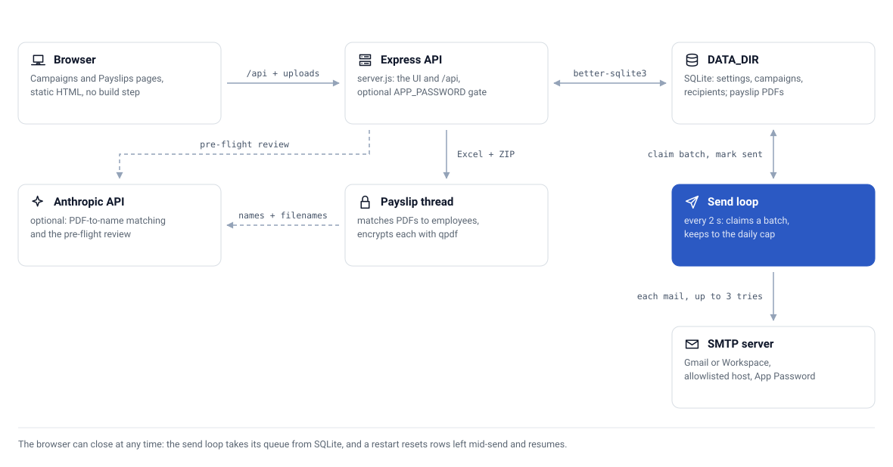
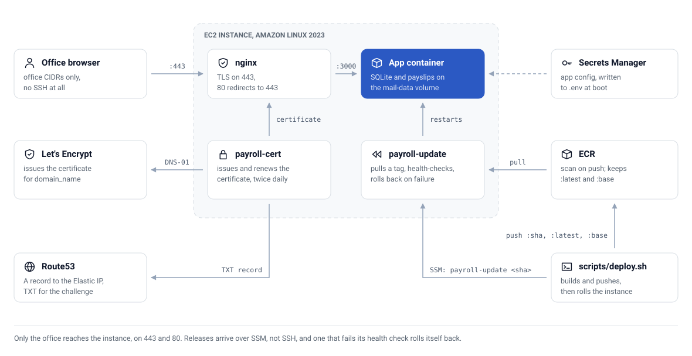

<div align="center">

# 💸 Payroll Mail Service

**Send personalised, password-protected payslips to your whole team — safely, in batches, from a single page**


[](https://github.com/CaputoDavide93/Payroll-Mail-Service/actions/workflows/ci.yml)

[Features](#-features) • [Architecture](#️-architecture) • [Quick Start](#-quick-start) • [Payslips](#-personalised-payslip-sender) • [Configuration](#️-configuration) • [Deployment](#-deployment) • [Troubleshooting](#️-troubleshooting)

</div>

---

## ✨ Features

| | Feature | What it does |
|---|---|---|
| 📇 | CSV Recipients | Upload any CSV with an `email` column — extra columns become template variables |
| ✍️ | Personalisation | Use `{name}`, `{department}`, or any CSV column in subject and body |
| 📎 | Attachment | Attach one file (PDF, etc.) up to 25 MB — same file goes to everyone |
| 🐢 | Batched Sending | Configurable batch size + pause between batches — never hammers the mail server |
| ⏰ | Scheduling | Set a future start time or send immediately |
| 🛟 | Daily Cap | Rolling 24-hour send limit keeps you inside Gmail / Workspace quotas |
| 🔁 | Crash-Safe Resume | SQLite-backed — restarts pick up exactly where they left off |
| 📊 | Live Dashboard | Sent / pending / failed counts, progress bar, pause / resume / stop / retry |
| 🔒 | UI Password | Optional `APP_PASSWORD` locks the web UI for cloud deployments |
| 📋 | Payslip Sender | AI-matched, NI-password-protected, per-recipient PDF payslips |
| 🗑️ | Payslip Retention | Protected PDFs deleted as soon as they're sent; whole runs purged after N days |
| 🛡️ | SMTP Host Allowlist | The UI can only point at approved SMTP hosts; changing host requires re-entering the password |
| 🌍 | Timezone-Correct Scheduling | Scheduled starts use the browser's timezone, not the server's |
| ☁️ | AWS Deploy | Terraform: one EC2 instance, nginx + Let's Encrypt TLS, image pulled from ECR, rollback on failed health check |

---

## 🗺️ Architecture

<picture>
  <source media="(prefers-color-scheme: dark)" srcset="docs/assets/architecture-dark.svg">
  
</picture>

- **Backend:** Node.js + Express. SMTP via `nodemailer`.
- **State:** Single SQLite file (`better-sqlite3`) under `DATA_DIR` holds settings, campaigns, and every recipient's status — what makes crash-safe resume possible.
- **Worker:** Background loop wakes every 2 s, promotes scheduled campaigns, sends the next batch (respecting the pause and daily cap), retries each failed send up to 3 times, and marks the campaign *completed* when the queue is empty.
- **Atomic claim:** Before sending a batch, recipients are marked `sending` in a single transaction — a crash can't cause double-sends; the startup hook resets `sending → pending`.
- **Payslips:** AI + fuzzy name matching (30 s timeout), `qpdf` 256-bit AES encryption in a worker thread, raw PDFs deleted immediately after protection, protected PDFs deleted after send, NI numbers never persisted.
- **Image:** Multi-stage Node 22 (Debian trixie) build from the lockfile, runs as the unprivileged `node` user.
- **Frontend:** Static HTML/CSS/JS — no build step.
- **Diagrams:** Drawn by `tools/gen_diagram.py` (Python standard library only) — run `python3 tools/gen_diagram.py` after changing one.

---

## 📋 Prerequisites

| Requirement | Version |
|-------------|---------|
| Docker | 20+ (recommended) |
| Node.js | 22+ (without Docker) |
| qpdf | Only without Docker — needed for payslip encryption |
| Gmail / Workspace | App Password required |

### Gmail Sending Limits

| Account Type | Daily Limit |
|---|---|
| Google Workspace | ~2,000 recipients/day |
| Free @gmail.com | ~500 recipients/day |

---

## 🚀 Quick Start

### 1. Clone the Repository

```bash
git clone https://github.com/CaputoDavide93/Payroll-Mail-Service.git
cd Payroll-Mail-Service
```

### 2. Configure Environment (optional)

```bash
cp .env.example .env
# Edit .env with your SMTP credentials and a strong APP_PASSWORD
```

### 3. Run with Docker

```bash
docker compose up -d --build
```

### 4. Open the App

Navigate to **http://localhost:3000** and click **⚙️ Settings** to enter your Gmail App Password.

To stop: `docker compose down` — your data survives in the `mail-data` Docker volume.

### Run Without Docker

```bash
npm ci
npm start
# open http://localhost:3000
```

---

## ⚙️ Configuration

Set in **⚙️ Settings** in the UI, or seed via environment variables. Copy `.env.example` to `.env`: Docker Compose substitutes it into the `environment:` block of [`docker-compose.yml`](docker-compose.yml). `npm start` does not read `.env`, so export the variables in your shell instead.

> [!NOTE]
> The local `docker-compose.yml` passes only `SMTP_HOST`, `SMTP_PORT`, `SMTP_USER`, `SMTP_PASS`, `FROM_EMAIL`, `FROM_NAME`, `DAILY_LIMIT` and `APP_PASSWORD` into the container. To use any other variable below in Docker, add it to that `environment:` block. The Anthropic API key can always be pasted in **⚙️ Settings** instead.

| Variable | Purpose | Default |
|----------|---------|---------|
| `SMTP_HOST` | Mail server hostname | `smtp.gmail.com` |
| `SMTP_HOST_ALLOWLIST` | SMTP hosts the UI may use (comma-separated; `*` = any, local dev only) | `smtp.gmail.com,smtp-relay.gmail.com` |
| `SMTP_PORT` | `465` (SSL) or `587` (STARTTLS) | `465` |
| `SMTP_USER` | Gmail / Workspace login address | – |
| `SMTP_PASS` | App Password | – |
| `FROM_EMAIL` | Address shown as sender | `SMTP_USER` |
| `FROM_NAME` | Name shown as sender | – |
| `DAILY_LIMIT` | Max emails per rolling 24 h | `1800` |
| `APP_PASSWORD` | Locks the web UI (recommended on cloud) | – (off) |
| `ANTHROPIC_API_KEY` | Enables AI matching + pre-flight check for payslips | – (off) |
| `PAYSLIP_DELETE_AFTER_SEND` | Delete each protected PDF once it has been sent | `true` |
| `PAYSLIP_RETENTION_DAYS` | Delete whole payslip runs this many days after preparation (`0` = never; runs still sending are kept) | `7` |
| `TRUST_PROXY` | Set to `1` behind one reverse proxy so login throttling sees real client IPs and HSTS is sent over HTTPS | – (off) |
| `PORT` | Port to serve on | `3000` |
| `DATA_DIR` | Database + uploads location | `data` (`/data` in Docker) |

---

## 📧 Sending Campaigns

### 1. One-Time Gmail Setup (App Password)

> App Passwords require **2-Step Verification** to be enabled on your Google account.

1. Enable 2-Step Verification: https://myaccount.google.com/signinoptions/twosv
2. Create an App Password: https://myaccount.google.com/apppasswords
   - Name it *Payroll Mail Service* → **Create**
   - Copy the 16-character password shown
3. Paste it into **⚙️ Settings** in the app

### 2. Prepare Your Recipients CSV

```csv
name,email,department
Alice Smith,alice@example.com,Engineering
Bob Jones,bob@example.com,Finance
```

- `email` is required; `name` is recommended
- Any extra column (`department`, `location`, etc.) can be used as `{department}` in the email
- Duplicate or invalid emails are skipped and reported

A ready-to-edit [`config/sample-recipients.example.csv`](config/sample-recipients.example.csv) is included.

### 3. Create and Send

1. Fill in **New send**: campaign name, subject, body (use `{name}` for the greeting)
2. Upload your **CSV** and optional **attachment** (PDF, etc., up to 25 MB)
3. Set **batch size** (10 is safe) and **interval** (60 s is gentle)
4. Optionally set a **schedule start** time, or tick **"Create without sending (draft)"**
5. Click **Create & send** — you can close the browser, sending continues on the server

Use **Send preview** on any campaign to email yourself the rendered message with the real attachment before it goes to 600 people.

---

## 📋 Personalised Payslip Sender

A dedicated workflow for sending each employee their own password-protected PDF payslip.

### How It Works

| Step | What Happens |
|------|-------------|
| **1. Upload** | Upload the employee Excel file + a ZIP of all payslip PDFs |
| **2. AI Match** | Claude AI + fuzzy matching pairs each PDF to the right employee by name |
| **3. Protect** | Each PDF is encrypted with the employee's NI number as the password (256-bit AES via `qpdf`) |
| **4. Pre-flight** | Optional AI review flags suspicious pairings before a single email is sent |
| **5. Send** | A per-recipient campaign is created — each person gets only their own payslip |
| **6. Cleanup** | Each protected PDF is deleted once sent; runs expire after `PAYSLIP_RETENTION_DAYS` (or delete them manually) |

### Excel Format

| Column | Notes |
|--------|-------|
| `EENo` | Employee number |
| `FullName` | Used for PDF matching |
| `NI No` | Used as the PDF password — never stored or logged |
| `Email Address` | Delivery address |

### Security Notes

- NI numbers are **never** stored, logged, or returned by any API — used only at the moment of PDF encryption
- Raw (unprotected) PDFs are deleted from disk as soon as protection completes
- The NI-number password is passed to `qpdf` through a private argfile, never on the command line
- ZIP uploads are capped (500 files, 25 MB per PDF, 200 MB total) to stop ZIP bombs
- Preparation runs in a worker thread with a 2-minute timeout, so a large upload can't freeze the UI
- Recipient email addresses are not written to the send logs
- The Anthropic API key can be provided via `ANTHROPIC_API_KEY` or in Settings — stored locally, never echoed back to the UI
- Full data-handling policy and vulnerability reporting: [SECURITY.md](SECURITY.md)

### Navigate to Payslips

Click **📋 Payslips** in the top navigation bar of the app.

---

## 📬 Deliverability — Staying Out of Spam

Sending hundreds of near-identical emails is exactly what spam filters watch for. Work through this checklist once with whoever manages your DNS:

- [ ] **SPF** — TXT record authorising Google to send: `v=spf1 include:_spf.google.com ~all`
- [ ] **DKIM** — enable in Google Admin (*Apps → Gmail → Authenticate email*) and publish the key
- [ ] **DMARC** — start gentle: `v=DMARC1; p=none; rua=mailto:dmarc@example.com`
- [ ] **Test first** — send a preview to a Gmail *and* an Outlook address before the full blast
- [ ] **Keep From on your domain** — don't send "as" an outside address
- [ ] **Real text in the body** — not just an image; include a contact or unsubscribe line
- [ ] **Warm up gently** — default 10-per-batch with 60 s gap spreads 600 over ~1 hour

---

## 📁 Repo structure

```text
Payroll-Mail-Service/
├── server.js                  # 🎛️ Express app + API routes
├── src/
│   ├── db.js                  # 🗄️ SQLite schema + migrations
│   ├── settings.js            # ⚙️ SMTP settings (env seeding, secret masking)
│   ├── mailer.js              # ✉️ transport, template rendering, sending
│   ├── parse-recipients.js    # 📇 CSV parsing & validation
│   ├── campaigns.js           # 📋 campaign / recipient queries
│   ├── worker.js              # 🐢 background batch-sending loop
│   ├── prepare-payslips.js    # 🔐 payslip pipeline (match → protect → manage)
│   ├── match-attachments.js   # 🧠 AI + fuzzy PDF-to-employee matching
│   ├── payslip-job-worker.js  # 🧵 worker thread running the payslip pipeline
│   └── time.js                # 🌍 timezone-aware schedule parsing
├── public/                    # 🖥️ web UI (campaigns + payslips pages)
├── tests/                     # 🧪 node --test suite
├── scripts/deploy.sh          # 🚀 build, push to ECR, roll the instance via SSM
├── tools/gen_diagram.py       # 🖌️ draws the README diagrams into docs/assets/
├── config/                    # 📝 sample-recipients.example.csv (recipient CSV template)
├── docs/assets/               # 🗺️ diagram SVGs, light and dark
├── terraform/                 # ☁️ AWS deployment (EC2, ECR, Route53, Secrets Manager)
├── .github/workflows/ci.yml   # 🤖 npm test + shellcheck on push and PR
├── Dockerfile                 # 🐳 multi-stage Node 22 image, non-root
├── docker-compose.yml         # 🐳 local service + mail-data volume
├── .env.example               # ⚙️ environment template
├── package.json  package-lock.json
├── .gitignore  .dockerignore
├── SECURITY.md                # 🔒 vulnerability reporting and data handling
└── LICENSE                    # 📄 MIT
```

---

## 🧪 Testing

```bash
npm ci
npm test          # node --test (needs qpdf on PATH for the payslip tests)
```

`tests/diagrams.test.js` also checks that the committed SVGs in `docs/assets/` match `tools/gen_diagram.py`.

CI ([ci.yml](.github/workflows/ci.yml)) runs `npm ci && npm test` on Node 22 with `qpdf` installed, plus `shellcheck scripts/deploy.sh`, on every push and pull request.

---

## 📦 Deployment

The app is a single container — deploy it anywhere Docker runs. Close your laptop and batches keep sending on schedule.

### 🌐 Any Linux server (VPS, EC2, etc.)

```bash
# 1. Install Docker
sudo apt-get update && sudo apt-get install -y docker.io git   # Debian/Ubuntu
# or: sudo dnf install -y docker git                           # Amazon Linux / RHEL

sudo systemctl enable --now docker
sudo usermod -aG docker $USER   # log out/in after this

# 2. Deploy the app
git clone https://github.com/CaputoDavide93/Payroll-Mail-Service.git payroll-mail
cd payroll-mail
cp .env.example .env
nano .env   # set SMTP_USER, SMTP_PASS, FROM_EMAIL, FROM_NAME, APP_PASSWORD
docker compose up -d --build
```

**Access via SSH tunnel** (simplest — no public port needed):

```bash
ssh -L 3000:localhost:3000 user@<server-ip>
# open http://localhost:3000 on your laptop
```

For team access, put Caddy or Nginx in front on port 443 for automatic HTTPS, and set `TRUST_PROXY=1`.

> **Security:** Always set `APP_PASSWORD` on any internet-facing server — without it the API is fully open.

### ☁️ AWS (Terraform)

`terraform/` builds a small, locked-down home for the app: one EC2 instance with an Elastic IP, reachable only from your office CIDRs, with TLS terminated on the box.

<picture>
  <source media="(prefers-color-scheme: dark)" srcset="docs/assets/aws-deployment-dark.svg">
  
</picture>

| Piece | What it does |
|-------|--------------|
| `terraform/bootstrap/` | One-off S3 bucket + DynamoDB table for Terraform state (named after your account ID) |
| `terraform/ec2.tf` | Instance, security group (443/80 from `office_cidrs` only — no SSH, use SSM Session Manager), Elastic IP |
| `terraform/ecr.tf` | ECR repo with scan-on-push; keeps `:latest`/`:base`, expires untagged images after 7 days |
| `terraform/dns.tf` | A record for `domain_name` in `hosted_zone` pointing at the Elastic IP |
| `terraform/secrets.tf` | App secret in Secrets Manager (Terraform never overwrites live values), IAM for ECR pull, SSM and the ACME TXT record |
| `terraform/user_data.sh.tpl` | Boot script: waits for secrets, writes `.env`, starts app + nginx, installs `payroll-cert` (issue/renew, twice daily) and `payroll-update` (pull a tag, health-check, auto-rollback) |
| `scripts/deploy.sh` | Builds and pushes the image, then rolls the instance to the new git SHA over SSM (`scripts/deploy.sh --roll <tag>` to roll back) |

```bash
cd terraform/bootstrap && terraform init && terraform apply && cd ..
# set the state bucket in main.tf (or: terraform init -backend-config="bucket=...")
cp terraform.tfvars.example terraform.tfvars   # office_cidrs, hosted_zone, domain_name
terraform init && terraform apply
../scripts/deploy.sh                           # build, push to ECR, roll the instance
```

Fill in the secret in Secrets Manager after the first apply — the instance waits at boot until real values are present. The instance is built to be **stopped between pay runs**: start it, wait ~2 minutes (the certificate is renewed on boot if due), send, then stop it. Don't stop or redeploy while a campaign is sending — the worker finishes its in-flight batch on shutdown and pending recipients resume on the next start.

---

## ⚠️ Notes & Limitations

- **Delivery is "at least once."** A recipient is marked *sent* only after the mail server accepts it. If the process is killed in the tiny window between acceptance and the DB write, that one recipient may get the email twice on restart. For payroll, a duplicate is far less harmful than a missed payslip.
- **App Password stored in SQLite** under `DATA_DIR`. Treat that volume as a secret and rotate the password in your Google account if it's ever exposed.
- **Changing the SMTP host** in Settings requires re-entering the app password, and only hosts on `SMTP_HOST_ALLOWLIST` are accepted.
- **Five wrong UI-password attempts** from one IP triggers a one-minute lockout.
- **One attachment per standard campaign**, up to 25 MB. Payslips use per-recipient attachments with no size limit beyond disk space.
- **Daily limit is a rolling 24-hour window**, not a calendar day.

---

## 🛠️ Troubleshooting

<details>
<summary>❌ Emails not sending — "Missing SMTP configuration"</summary>

Open **⚙️ Settings**, fill in all SMTP fields, and click **Save**. Then use **Send test** to confirm the connection works before creating a campaign.
</details>

<details>
<summary>❌ Test email goes to spam</summary>

Check SPF, DKIM, and DMARC are configured on your domain (see [Deliverability](#-deliverability--staying-out-of-spam)). DKIM is the most important one.
</details>

<details>
<summary>❌ Payslip preparation fails — "qpdf is not installed"</summary>

`qpdf` is included in the Docker image. If running without Docker, install it:

```bash
# Debian / Ubuntu
sudo apt install qpdf

# macOS
brew install qpdf
```
</details>

<details>
<summary>❌ No AI matching — payslips only use fuzzy match</summary>

Paste the key in **⚙️ Settings** (it's stored locally and never echoed back). An `ANTHROPIC_API_KEY` environment variable also works with `npm start`; in Docker it only reaches the container if you add it to the `environment:` block of the compose file.
</details>

<details>
<summary>❌ "SMTP host … is not allowed"</summary>

The host isn't on `SMTP_HOST_ALLOWLIST`. Add it (comma-separated) to `SMTP_HOST_ALLOWLIST`: exported in your shell for `npm start`, in the `environment:` block of `docker-compose.yml` for local Docker, or as `smtp_host_allowlist` in `terraform.tfvars` on AWS. Then restart.
</details>

<details>
<summary>❌ "payslip files in this run have already been sent or expired"</summary>

Protected PDFs are deleted after sending and runs expire after `PAYSLIP_RETENTION_DAYS`. Upload the Excel and ZIP again to prepare a fresh run.
</details>

<details>
<summary>❌ Container starts but UI shows a blank page</summary>

```bash
docker logs payroll-mail-service
```

Check for port conflicts (something else on 3000) or missing env vars.
</details>

<details>
<summary>❌ Data lost after docker compose down</summary>

Data lives in the `mail-data` Docker volume. `docker compose down` preserves it. Only `docker compose down -v` removes it.
</details>

---

## 🔒 Security

Payslips carry payroll PII. NI numbers are never stored or logged, protected PDFs are deleted after sending, and `APP_PASSWORD` should always be set on a server. See [SECURITY.md](SECURITY.md) for the full data-handling policy and how to report a vulnerability.

---

## 🤝 Contributing

Contributions are welcome! Please open an issue first to discuss large changes.

1. Fork the repository
2. Create a feature branch (`git checkout -b feature/amazing-feature`)
3. Commit your changes (`git commit -m 'Add amazing feature'`)
4. Push to the branch (`git push origin feature/amazing-feature`)
5. Open a Pull Request

---

## 📄 License

This project is licensed under the MIT License — see the [LICENSE](LICENSE) file for details.

---

<p align="center">
  <sub>⭐ If this project helped you, please give it a star! ⭐</sub>
  <br>
  <sub>Made with ❤️ by <a href="https://github.com/CaputoDavide93">Davide Caputo</a></sub>
</p>
